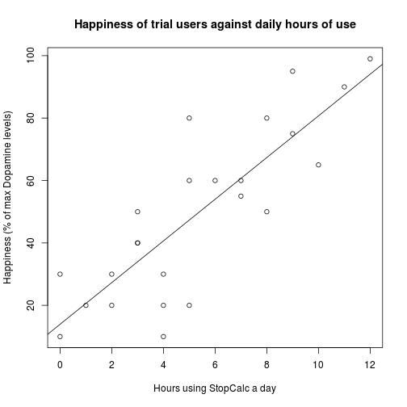

## StopCalc  

### Introducing to you, StopCalc, a creative and innovative solution to society's most important problem.                            
                
                        
                                    
                                            

## How we can change your life

### StopCalc is an intuitive, well designed app designed with the revolutionary Shiny framework for R. It handles exceptionally complex calculations extremely quickly, and is even able to predict the future!

---

## Our trials so far

### We have been in the alpha phase for about 2 months now, since our inception we have been collecting data on hours of StopCalc used per day and happinesss levels as measured by dopamine levels in the brain. We have seen tremendously positive results, and there is a clear correlation between more StopCalc use and higher happiness levels.

---

 

---

## How it really works

### StopCalc may seem simple at first glance, however if you take a look under the hood you are able to see how incredibly sophisticated it really is. We have used cutting edge machine learning algorithms in order to provide the most accurate prediction possible. 
